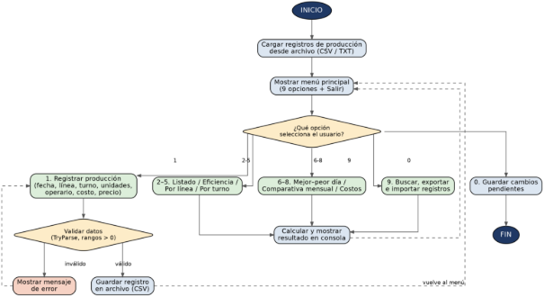

*OptimaCode Industrial — Sistema de Registro de Producción y Eficiencia*

**UNIVERSIDAD PRIVADA DOMINGO SAVIO**

**CARRERA DE INGENIERÍA INDUSTRIAL**

**OPTIMACODE INDUSTRIAL**

**Sistema de Registro de Producción y Eficiencia**

**Especialidad:** Ingeniería Industrial

**Materia:** Programación numérica y aplicaciones

**Autores:** 	Alvarez Palli Bitaly

`	`Villca Yarari Diego Eduardo

`       `Escalante Cruz Waldo

**Fecha:** 01/09/2026

**LA PAZ – BOLIVIA**

**2026**

**Datos Generales y Equipo de Trabajo**

A continuación, se presentan los datos generales de la asignatura y el equipo de trabajo responsable del desarrollo del sistema OptimaCode Industrial, conforme al formato de proyecto establecido por la asignatura.

|**Campo**|**Detalle**|
| :- | :- |
|Asignatura|Programación Numérica y Aplicaciones|
|Carrera|Ingeniería Industrial — 4to Semestre|
|Gestión|2026|
|Docente|Lic. Andrés Grover Albino Chambi|

**Equipo de Trabajo**

El desarrollo del sistema estuvo a cargo del siguiente equipo de trabajo, con los roles asignados según las responsabilidades definidas para el proyecto:

|**Integrante**|**Rol en el Proyecto**|
| :- | :- |
|Alvarez Bitaly|Persistencia de Datos y Registro|
|Villca Diego|Lógica de Negocio y Búsquedas|
|Escalante Waldo|Reportes, Cálculos y Validaciones|

**Índice**

1\. Introducción	4

1\.1 Contexto General	4

1\.2 Problemática	5

1\.3 Justificación	5

1\.4 Alcance	6

1\.5 Limitaciones	7

2\. Objetivos	7

2\.1 Objetivo General	7

2\.2 Objetivos Específicos	8

3\. Marco Teórico	9

3\.1 Programación Orientada a Objetos (POO)	9

3\.2 Estructuras (Structs)	9

3\.3 Persistencia de Datos en Archivos Planos (CSV y TXT)	10

3\.4 Matrices Bidimensionales	10

3\.5 Manejo de Excepciones y Validación de Datos	10

4\. Desarrollo del Proyecto	11

4\.1 Descripción General del Sistema	11

4\.2 Estructura del Sistema	11

4\.3 Gestión de Registros de Producción	12

4\.4 Registro y Cálculo de Eficiencia	13

4\.5 Matriz de Comparación Mensual entre Gestiones	14

4\.6 Reportes y Estadísticas	14

4\.7 Diagrama de Flujo del Sistema	16

5\. Tecnologías Utilizadas	17

6\. Instalación y Ejecución del Sistema	17

6\.1 Opción 1: Ejecución desde el Código Fuente	18

6\.2 Opción 2: Ejecución del Archivo Ejecutable (.exe)	18

7\. Conclusiones y Recomendaciones	19

7\.1 Conclusiones	19

7\.2 Recomendaciones	19

**1. Introducción**

**1.1 Contexto General**

En las actividades productivas es fundamental contar con mecanismos que permitan registrar y controlar la cantidad de productos elaborados, las metas establecidas, los costos involucrados y los resultados obtenidos durante cada jornada de trabajo. Una fábrica que opera con varias líneas de producción y tres turnos diarios (mañana, tarde y noche) necesita un mecanismo confiable para saber, día a día, cuánto se produjo, en qué línea, en qué turno y bajo la responsabilidad de qué operario.

El control adecuado de la producción permite conocer el rendimiento de una empresa, identificar dificultades operativas y tomar decisiones basadas en información registrada de forma consistente. Por esta razón, el desarrollo de un sistema informático para el registro de producción y el cálculo de eficiencia constituye una herramienta útil para organizar y analizar los datos generados durante las actividades productivas, alineándose con el ODS 9 — Industria, Innovación e Infraestructura, al promover procesos industriales más organizados, medibles y eficientes.

El presente proyecto propone el desarrollo de una aplicación de consola en C# (.NET) denominada OptimaCode Industrial — Sistema de Registro de Producción y Eficiencia, orientada a la administración de partes de producción diarios, al cálculo automático de indicadores de eficiencia respecto a una meta de referencia, y a la evaluación de la viabilidad económica de cada línea de producción.

Como parte del proceso de diseño, el equipo desarrolló primero un prototipo interactivo en HTML, CSS y JavaScript que reproduce las pantallas, los cálculos y los reportes del sistema. Este prototipo sirvió para validar la lógica de negocio, los campos requeridos y el formato de los reportes antes de trasladar dicha lógica a la aplicación de consola definitiva en C#.

**1.2 Problemática**

En diferentes procesos productivos, el registro de información se realiza todavía de forma manual mediante cuadernos, hojas de cálculo dispersas o documentos independientes por turno. Esta situación genera pérdida de información, errores de digitación, dificultad para calcular indicadores de manera consistente y demoras al momento de comparar la producción planificada con la producción realmente obtenida.

Adicionalmente, cuando la información no está centralizada resulta complejo identificar qué línea o qué turno presenta menor rendimiento, determinar si el precio de venta de un producto cubre razonablemente su costo de materia prima, o comparar el comportamiento de la producción entre distintos meses y distintas gestiones (años).

Ante esta problemática surge la necesidad de desarrollar un sistema que permita registrar de manera organizada los partes de producción diarios y realizar automáticamente los cálculos de eficiencia, rentabilidad y comparación histórica que actualmente se hacen de forma manual y poco confiable.

**1.3 Justificación**

El desarrollo del Sistema de Registro de Producción y Eficiencia se justifica por la necesidad de disponer de una herramienta sencilla que permita registrar, almacenar y procesar información relacionada con la producción diaria de una fábrica organizada por líneas y turnos.

El sistema facilita el registro de la línea de producción, el turno, las unidades producidas, el operario responsable, el costo de materia prima por unidad y el precio de venta por unidad, datos suficientes para calcular tanto el rendimiento operativo (eficiencia) como el rendimiento económico (margen y viabilidad) de cada parte de producción.

Mediante el cálculo automático de estos indicadores, la fábrica puede identificar rápidamente si una línea o un turno están cumpliendo la meta establecida, si un producto se está vendiendo con un margen saludable, y qué días del mes concentran la mayor o menor producción.

Desde el punto de vista académico, el proyecto permite aplicar conocimientos de programación orientada a objetos, estructuras de datos (structs), matrices bidimensionales, validación de información mediante TryParse, manejo de excepciones y persistencia de datos en archivos planos, contenidos centrales de la asignatura de Programación numérica y aplicaciones.

**1.4 Alcance**

El sistema comprende el registro y la administración de la información relacionada con los partes de producción diarios de una fábrica. Entre sus principales funciones se encuentran:

- Registrar un nuevo parte de producción (fecha, línea, turno, unidades producidas, operario, costo de materia prima y precio de venta por unidad).
- Listar todos los registros almacenados, con una meta de referencia visible y clasificación por colores.
- Calcular la eficiencia de un registro específico, permitiendo definir una meta distinta a la meta por defecto.
- Generar el reporte de producción por línea, con el total producido y el rendimiento de cada línea.
- Generar el reporte de producción por turno (mañana, tarde y noche).
- Identificar el mejor y el peor día del mes según el total de unidades producidas.
- Generar una matriz comparativa mensual entre gestiones (años), útil para el análisis histórico.
- Calcular el margen y la viabilidad económica de cada registro y la rentabilidad acumulada por línea.
- Buscar registros por fecha exacta, por línea o por operario.
- Exportar reportes en formato TXT, CSV/Excel, PDF y Word.
- Importar registros previamente exportados en formato JSON.

El sistema está orientado principalmente a fines académicos y puede utilizarse como base para desarrollar posteriormente una aplicación de mayor escala, con persistencia en base de datos e interfaz gráfica.

**1.5 Limitaciones**

El sistema funciona como una aplicación de consola y depende de la correcta introducción de los datos por parte del usuario. La información se almacena mediante archivos planos (CSV y TXT), por lo que no cuenta con las características avanzadas de una base de datos relacional, como transacciones o control de concurrencia entre varios usuarios.

La meta de producción utilizada para calcular la eficiencia tiene un valor de referencia fijo (120 unidades por turno), el cual puede sobrescribirse únicamente al momento de consultar un registro puntual, y no se gestiona todavía como una meta configurable por línea o por producto. El sistema tampoco incorpora una interfaz gráfica ni conexión entre múltiples usuarios en tiempo real; el prototipo web desarrollado cumple únicamente un rol de validación de diseño.

**2. Objetivos**

**2.1 Objetivo General**

Desarrollar una aplicación de consola denominada OptimaCode Industrial — Sistema de Registro de Producción y Eficiencia, utilizando C# (.NET), que permita registrar, administrar y analizar la información de los partes de producción diarios de una fábrica organizada por líneas y turnos, mediante estructuras de datos, validaciones, cálculo de indicadores de eficiencia y viabilidad económica, matrices de comparación histórica y mecanismos de persistencia en archivos.

**2.2 Objetivos Específicos**

- Registrar información de cada parte de producción: fecha, línea, turno, unidades producidas y operario responsable.
- Registrar el costo de materia prima y el precio de venta por unidad para permitir el análisis económico de cada registro.
- Implementar validaciones que eviten el ingreso de datos incorrectos, utilizando bucles de validación y TryParse.
- Calcular automáticamente el porcentaje de eficiencia de cada registro respecto a una meta de producción por turno.
- Clasificar la eficiencia obtenida en los niveles Crítico, Precaución y Aceptable.
- Calcular el margen y clasificar la viabilidad económica de cada registro en los niveles No viable, Precaución y Viable.
- Utilizar estructuras (struct) para organizar la información de cada registro de producción.
- Implementar una matriz bidimensional para comparar la producción mensual entre distintas gestiones (años).
- Generar reportes de producción agrupados por línea y por turno.
- Identificar el mejor y el peor día del mes en función de las unidades producidas.
- Permitir la búsqueda de registros por fecha, línea u operario.
- Mantener la persistencia de los datos mediante archivos CSV y generar reportes exportables en TXT, PDF y Word.
- Aplicar programación orientada a objetos y programación estructurada durante el desarrollo del sistema.

**3. Marco Teórico**

**3.1 Programación Orientada a Objetos (POO)**

La Programación Orientada a Objetos es un paradigma que permite organizar un programa mediante clases, objetos, atributos y métodos. En C#, este paradigma facilita representar elementos del mundo real dentro de un sistema informático; para el presente proyecto se representan entidades como el registro de producción, el reporte de eficiencia y el reporte de costos. La utilización de POO permite separar responsabilidades entre la captura de datos, los cálculos y la generación de reportes, mejorando la organización, el mantenimiento y la comprensión del código.

**3.2 Estructuras (Structs)**

Las estructuras (struct) son tipos de valor disponibles en C# que permiten agrupar diferentes datos relacionados. Dentro del sistema se utilizan para representar un registro de producción, agrupando información como:

- Identificador del registro (Id).
- Fecha del parte de producción.
- Línea de producción (por ejemplo, Ensamble A).
- Turno (1: Mañana, 2: Tarde, 3: Noche).
- Unidades producidas.
- Operario responsable.
- Costo de materia prima por unidad.
- Precio de venta por unidad.

El uso de estructuras permite mantener agrupada la información correspondiente a cada registro y facilita el paso de estos datos entre los distintos métodos del sistema.

**3.3 Persistencia de Datos en Archivos Planos (CSV y TXT)**

La persistencia permite conservar la información incluso después de cerrar la aplicación. En el proyecto se utiliza un archivo CSV para almacenar de manera estructurada cada parte de producción, donde cada registro corresponde a una fila y cada dato se separa mediante un delimitador.

Los archivos TXT se utilizan para generar reportes legibles por el usuario, como el listado general, el reporte por línea, el reporte por turno o el reporte de costos y viabilidad, permitiendo exportar la información sin necesidad de utilizar una base de datos.

**3.4 Matrices Bidimensionales**

Una matriz bidimensional permite almacenar información organizada en filas y columnas. En el sistema se utiliza una matriz para representar la producción mensual agrupada por gestión (año): las filas representan los doce meses del año y las columnas representan cada gestión registrada en el sistema. Esta estructura facilita comparar visualmente el comportamiento de la producción entre distintos períodos y detectar meses con crecimiento o caída de la producción.

**3.5 Manejo de Excepciones y Validación de Datos**

La validación de datos es necesaria para evitar errores durante la ejecución del programa. El sistema utiliza métodos como TryParse para comprobar que los valores numéricos ingresados (unidades, costo de materia prima, precio de venta) sean válidos antes de realizar operaciones matemáticas, verificando además que las cantidades no sean negativas y que el precio de venta sea mayor a cero.

También se utilizan mecanismos de manejo de excepciones para controlar situaciones como errores al abrir, leer o escribir los archivos CSV y TXT, mejorando la seguridad y estabilidad del sistema.

**4. Desarrollo del Proyecto**

**4.1 Descripción General del Sistema**

El sistema OptimaCode Industrial es una aplicación de consola desarrollada en C# (.NET). Su función principal es permitir al usuario registrar los partes de producción diarios y obtener indicadores que permitan conocer tanto el nivel de eficiencia operativa como la viabilidad económica alcanzada en cada línea y turno.

El sistema permite introducir datos de producción, almacenarlos, consultarlos y generar información estadística y económica. El cálculo básico de eficiencia se realiza mediante la siguiente fórmula, considerando una meta de referencia de 120 unidades por turno:

***Eficiencia (%) = (Unidades producidas × 100) / Meta***

Por ejemplo, si en un turno se estableció la meta por defecto de 120 unidades y se produjeron 118 unidades:

***Eficiencia = (118 × 100) / 120 = 98,3 %***

De esta manera, el sistema proporciona un indicador sencillo y clasificado por niveles para evaluar el cumplimiento de las metas productivas.

**4.2 Estructura del Sistema**

El sistema está organizado mediante diferentes componentes que permiten separar las responsabilidades del programa. Entre los principales componentes se consideran:

**RegistroProduccion (Struct):** Almacena los datos principales de cada parte de producción: Id, Fecha, Línea, Turno, Unidades, Operario, CostoMateriaPrima y PrecioVenta.

**MenuConsola:** Administra la interacción entre el usuario y el sistema mediante un menú de nueve opciones: Registrar, Listado, Eficiencia, Por línea, Por turno, Mejor/Peor día, Comparativa mensual entre gestiones, Costos y viabilidad, y Buscar, además de la opción Salir.

**AlgoritmosProduccion:** Contiene los procedimientos para calcular la eficiencia, clasificar los niveles de eficiencia y viabilidad, y construir la matriz comparativa mensual entre gestiones.

**Configuracion:** Centraliza las rutas utilizadas para almacenar y consultar los archivos CSV y TXT del sistema.

**Validadores:** Contiene métodos para validar la información ingresada por el usuario mediante bucles de validación y TryParse.

**Reportes:** Genera el listado general, los reportes por línea y por turno, el reporte de mejor/peor día, la matriz comparativa, el reporte de costos y viabilidad, y exporta los reportes en TXT, CSV, PDF y Word.

**4.3 Gestión de Registros de Producción**

El sistema permite registrar información relacionada con cada parte de producción. Para realizar un registro, el usuario introduce:

- Fecha del parte de producción.
- Línea de producción (por ejemplo, Ensamble A).
- Turno: 1 (Mañana), 2 (Tarde) o 3 (Noche).
- Unidades producidas (número entero mayor a cero).
- Nombre del operario responsable.
- Costo de materia prima por unidad, en bolivianos.
- Precio de venta por unidad, en bolivianos.

Antes de guardar la información, el sistema valida que las unidades no sean negativas ni iguales a cero, que el costo de materia prima no sea negativo y que el precio de venta sea mayor a cero. Una vez validada la información, cada registro se almacena en un archivo CSV con un identificador autoincremental, manteniendo así la persistencia de los datos entre distintas ejecuciones del programa.

**4.4 Registro y Cálculo de Eficiencia**

Una de las funciones principales del sistema es calcular el porcentaje de eficiencia de un registro específico. Para ello, el usuario selecciona el registro y, opcionalmente, indica una meta distinta a la meta por defecto (120 unidades por turno). El sistema aplica la siguiente fórmula:

***Eficiencia (%) = (Unidades producidas × 100) / Meta***

El resultado se clasifica en tres niveles, de manera que el usuario identifique de inmediato el estado del registro consultado:

|**Nivel**|**Rango de eficiencia**|**Interpretación**|
| :- | :- | :- |
|Crítico|Menor a 70 %|Producción muy por debajo de la meta del turno|
|Precaución|Entre 70 % y 89,9 %|Producción cercana a la meta, requiere seguimiento|
|Aceptable|90 % o más|Meta del turno alcanzada o superada|

Estos niveles también se utilizan en el listado general de registros y en los reportes por línea y por turno, mostrando junto a cada fila una etiqueta de color que facilita la lectura visual del reporte.

**4.5 Matriz de Comparación Mensual entre Gestiones**

El sistema utiliza una matriz bidimensional para realizar el seguimiento de la producción a lo largo del tiempo: las filas representan los doce meses del año y las columnas representan cada gestión (año) presente en los registros almacenados. Cada celda de la matriz contiene el total de unidades producidas en ese mes durante esa gestión.

|**Mes**|**Gestión 2024**|**Gestión 2025**|**Gestión 2026**|
| :- | :- | :- | :- |
|Enero|—|2 450|2 610|
|Febrero|—|2 380|2 705|
|Marzo|—|2 510|—|
|…|…|…|…|

Esta matriz permite comparar de un vistazo el comportamiento de la producción entre distintas gestiones, identificar meses de mayor o menor actividad y apoyar la planificación de metas para períodos futuros.

**4.6 Reportes y Estadísticas**

El sistema genera información resumida que permite analizar los registros almacenados desde distintas perspectivas:

- Listado general: muestra todos los registros junto con la meta de referencia (120 unidades por turno) y una leyenda de colores (Crítico, Precaución, Aceptable).
- Eficiencia de un registro: permite calcular la eficiencia de un registro puntual con una meta editable.
- Reporte por línea: agrupa los registros por línea de producción, calculando el total de unidades, la meta acumulada (meta por defecto multiplicada por el número de registros de la línea) y el rendimiento porcentual de cada línea.
- Reporte por turno: agrupa los registros en los tres turnos (mañana, tarde y noche), mostrando el total producido y el rendimiento de cada turno.
- Mejor y peor día: suma las unidades producidas por fecha e identifica el día con mayor y el día con menor producción del período registrado.
- Comparativa mensual entre gestiones: presenta la matriz descrita en el punto 4.5.
- Costos y viabilidad: calcula, para cada registro con costo y precio de venta, el margen unitario (precio de venta menos costo de materia prima) y el margen porcentual, clasificando la viabilidad según la tabla siguiente; adicionalmente calcula la rentabilidad acumulada por línea (costo total, ingreso total y utilidad).

|**Nivel**|**Margen sobre precio de venta**|**Interpretación**|
| :- | :- | :- |
|No viable|Menor a 10 %|El costo de materia prima absorbe casi todo el precio de venta|
|Precaución|Entre 10 % y 24,9 %|Margen ajustado, rentabilidad limitada|
|Viable|25 % o más|Margen saludable respecto al precio de venta|

- Búsqueda de registros: permite localizar registros por fecha exacta, por coincidencia parcial en el nombre de la línea o por coincidencia parcial en el nombre del operario.
- Exportación e importación: los reportes pueden exportarse en formato TXT, CSV (compatible con Excel), PDF y Word; adicionalmente el sistema permite importar registros previamente exportados en formato JSON, evitando volver a digitar información ya registrada.

Estos reportes pueden mostrarse directamente en la consola y también guardarse en archivos TXT, lo que permite conservar un historial de los resultados obtenidos y facilita su posterior consulta.

**4.7 Diagrama de Flujo del Sistema**

El siguiente diagrama resume el funcionamiento general del sistema OptimaCode Industrial, desde el inicio del programa y la carga de los registros almacenados, pasando por el menú principal con sus nueve opciones, hasta el registro validado de un nuevo parte de producción, el cálculo y despliegue de los distintos reportes, y la salida del programa.

*Figura 1. Diagrama de flujo general del sistema OptimaCode Industrial.*

El flujo comienza con la carga de los registros de producción almacenados en el archivo CSV. A partir del menú principal, el usuario puede registrar un nuevo parte de producción, el cual pasa por un proceso de validación de datos antes de guardarse; si la validación falla, el sistema muestra un mensaje de error y solicita nuevamente la información. Las demás opciones del menú (consultas de listado y eficiencia, reportes por línea y turno, comparativas, costos, búsquedas y exportaciones) confluyen en un mismo proceso de cálculo y despliegue de resultados en consola, tras el cual el sistema retorna siempre al menú principal, hasta que el usuario selecciona la opción de salir y el programa guarda los cambios pendientes antes de finalizar.

**5. Tecnologías Utilizadas**

- Lenguaje de programación: C#.
- Plataforma: .NET.
- Paradigma: Programación Orientada a Objetos y programación estructurada.
- Entorno de desarrollo: Visual Studio.
- Persistencia: archivos CSV y TXT.
- Control de versiones: Git y GitHub.
- Interfaz: aplicación de consola.
- Prototipo de validación de diseño: HTML5, CSS3 y JavaScript, utilizado para probar la lógica de negocio, los campos del formulario de registro y el formato de los reportes antes de su implementación final en C#.

C# permite implementar las estructuras, métodos, validaciones y operaciones matemáticas necesarias para el funcionamiento del sistema, mientras que el prototipo web sirvió como referencia visual y funcional durante la etapa de diseño.

**6. Instalación y Ejecución del Sistema**

Además de poder compilarse y ejecutarse desde Visual Studio, el proyecto fue publicado como una aplicación ejecutable independiente (.exe) mediante dotnet publish. Esto permite distribuir y ejecutar el sistema directamente en cualquier computadora con Windows, sin necesidad de tener instalado Visual Studio ni el SDK de .NET. A continuación se describen las dos formas de poner en funcionamiento el sistema.

**6.1 Opción 1: Ejecución desde el Código Fuente**

Para ejecutar el proyecto desde el código fuente en Visual Studio, se deben seguir los siguientes pasos:

1\. Clonar el repositorio del proyecto mediante el siguiente comando:

|git clone [IAMBITALY/ProyectoRegistrodeProduccionOficial: RegistrodeProducionGrupo2](https://github.com/IAMBITALY/ProyectoRegistrodeProduccionOficial)|
| :- |

2\. Abrir la solución PROYECTOG2COMPLET.slnx en Visual Studio 2019 o 2022.

3\. Compilar y ejecutar el proyecto (tecla F5 o Ctrl+F5).

4\. Link Video en Youtube:

|
<https://youtu.be/ksP-WsNR0qE>

[🚀 OptimaCode Industrial: Sistema de Registro de Producción y Eficiencia | Proyecto en C# y Web 🏭](https://www.youtube.com/watch?v=ksP-WsNR0qE)
|
| :- |

**6.2 Opción 2: Ejecución del Archivo Ejecutable (.exe)**

Para ejecutar el sistema sin necesidad de compilarlo, se debe utilizar la versión publicada como ejecutable independiente:

1\. Descargar o clonar el repositorio del proyecto.

2\. Ubicar el archivo PROYECTOG2COMPLET.exe dentro de la carpeta de publicación (bin/Release/net…/publish).

3\. Hacer doble clic sobre el archivo .exe para iniciar el programa directamente, sin abrir Visual Studio.

Esta doble forma de distribución —código fuente y ejecutable— facilita la evaluación del proyecto tanto en entornos de desarrollo como en computadoras que no cuentan con las herramientas de programación instaladas.

**7. Conclusiones y Recomendaciones**

**7.1 Conclusiones**

El desarrollo del Sistema de Registro de Producción y Eficiencia (OptimaCode Industrial) permite demostrar la aplicación de distintos conceptos de programación en una problemática real relacionada con el control de procesos productivos organizados por línea y turno.

El sistema permite organizar los registros de producción, almacenar información, validar los datos ingresados y calcular automáticamente indicadores de eficiencia operativa y de viabilidad económica, integrando aspectos técnicos y de gestión en una sola herramienta.

La utilización de estructuras, matrices bidimensionales y archivos planos permite desarrollar una aplicación modular y organizada, facilitando el procesamiento de los datos de producción y su comparación histórica entre distintas gestiones.

El cálculo de eficiencia y de margen económico permite comparar la producción y los costos planificados con los resultados reales, obteniendo información útil para evaluar el cumplimiento de las metas y la rentabilidad de cada línea de producción.

Finalmente, el proyecto demuestra la importancia de utilizar herramientas informáticas —incluyendo un prototipo de validación previo— para organizar información y facilitar el análisis de procesos productivos en el contexto del ODS 9.

**7.2 Recomendaciones**

- Implementar una base de datos relacional, como SQL Server o SQLite, en reemplazo de los archivos planos.
- Incorporar una interfaz gráfica de escritorio o web conectada al mismo motor de cálculo desarrollado en C#.
- Permitir configurar la meta de producción por línea o por producto, en lugar de utilizar un único valor por defecto.
- Permitir distintos usuarios y niveles de acceso al sistema.
- Generar gráficos estadísticos a partir de los reportes de eficiencia y de la matriz comparativa mensual.
- Incorporar filtros adicionales por rango de fechas y por combinación de línea y turno.
- Implementar copias de seguridad automáticas de los archivos de registros.
- Ampliar los formatos de exportación e integrar el prototipo web como interfaz cliente conectada al sistema en C# mediante una API.
- Incorporar indicadores adicionales de productividad, como el costo por unidad producida y el tiempo promedio por turno.
- Mejorar los mecanismos de seguridad y validación de la información ingresada por el usuario.

Estas mejoras permitirían convertir el proyecto académico en un sistema más completo y escalable, manteniendo la base sólida construida durante esta primera etapa de desarrollo.
2
